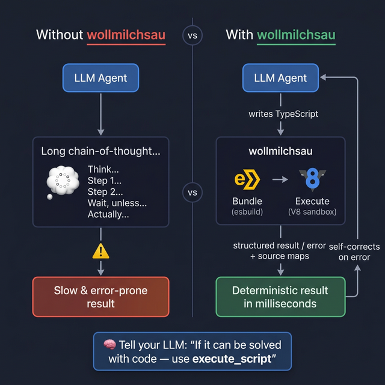

# wollmilchsau — Lass das LLM rechnen statt denken.

> **Der klügere Ansatz:** Wenn ein Problem mit einem kleinen Programm lösbar ist — lass das LLM keinen langen Denkprozess durchlaufen. Gib ihm eine Sandbox, lass es eine TypeScript-Lösung schreiben, und erhalte in Millisekunden ein deterministisches Ergebnis.

Copyright (c) 2026 Michael Lechner. Lizenziert unter der MIT-Lizenz.

> 🇬🇧 [English Version](README.md)

---

## Das Problem: LLMs verschwenden Zeit mit "Denken"

LLMs verbringen oft Dutzende von Tokens — und wertvolle Reasoning-Zeit — damit, Probleme zu durchdenken, die ein einfaches Programm in unter einer Millisekunde lösen könnte:

- Daten parsen und transformieren
- Komplexe Berechnungen oder Aggregationen
- Regex-basierte Textverarbeitung
- Sortieren, Filtern und Formatieren

**wollmilchsau** gibt deinem KI-Agenten eine JavaScript/TypeScript-Sandbox. Anstatt sich durch eine endlose Chain-of-Thought zu quälen, schreibt der Agent ein kleines Programm, führt es aus und erhält ein präzises Ergebnis.

### So gibst du deinem LLM die richtige Anweisung

Füge das deinem System-Prompt hinzu:

> *"Wenn eine Aufgabe einfacher oder zuverlässiger mit einem kleinen Programm lösbar ist (z.B. Datentransformation, Berechnung, Parsing), benutze das `execute_script` Tool. Rechne nicht durch, was du berechnen kannst."*

---

## Wie es funktioniert



**Der Ablauf:** Agent schreibt Code → wollmilchsau führt ihn aus → gibt strukturiertes Ergebnis oder Fehler mit Source Maps zurück → Agent korrigiert und wiederholt. **Selbstkorrigierend by Design.**

---

## Features

| Feature | Beschreibung |
|---|---|
| 🔐 **Sandboxed V8** | Kein Netzwerk, kein Dateisystem, keine Node.js APIs |
| ⚡ **In-Process esbuild** | TypeScript-Bundling in Mikrosekunden, kein Subprocess |
| 🗺️ **Source Maps** | Fehler zeigen auf die exakte TypeScript-Zeile |
| 📦 **Artefakt-Integration** | Große Ausgaben werden automatisch in `mlcartifact` gespeichert |
| 🗂️ **ZIP Request Logging** | Vollständiger Audit-Trail jeder LLM-Codeausführung |
| 🔌 **stdio + SSE** | Lokal (Claude Desktop) und remote nutzbar |

---

## Erste Schritte

### Installation (Linux)

```bash
# via Installations-Script
curl -sfL https://raw.githubusercontent.com/hmsoft0815/wollmilchsau/main/scripts/install.sh | sh

# oder .deb / .rpm von den Releases herunterladen
```

> [!NOTE]
> Aufgrund der V8-Abhängigkeit (CGO) stellen wir automatisierte Binaries nur für **Linux amd64** bereit. Für macOS/Windows bitte aus dem Quellcode bauen.

### Aus dem Quellcode bauen

```bash
# erfordert build-essential (Linux) oder llvm (macOS)
make build
# → build/wollmilchsau
```

### Docker

```bash
docker build -t wollmilchsau .
docker run -p 8000:8000 wollmilchsau
```

### Starten

```bash
# stdio-Modus (für Claude Desktop)
./build/wollmilchsau

# SSE/HTTP-Modus (für Remote-Agenten)
./build/wollmilchsau -addr :8080

# mit vollständigem Request-Logging
./build/wollmilchsau -log-dir /var/log/wollmilchsau
```

---

## Claude Desktop Integration

Zur Konfigurationsdatei hinzufügen:

- **macOS**: `~/Library/Application Support/Claude/claude_desktop_config.json`
- **Windows**: `%APPDATA%\Claude\claude_desktop_config.json`

```json
{
  "mcpServers": {
    "wollmilchsau": {
      "command": "wollmilchsau",
      "args": ["-log-dir", "/dein/log/pfad"]
    }
  }
}
```

---

## MCP Tools

### `execute_script`
Führt einen einzelnen TypeScript/JavaScript-Snippet aus.
- `code` — Der auszuführende Code
- `timeoutMs` — Optional, Standard 10s

### `execute_project`
Führt ein Multi-File-TypeScript-Projekt aus.
- `files` — Array aus `{name, content}` Objekten
- `entryPoint` — Startdatei (z.B. `main.ts`)
- `timeoutMs` — Optional

### `check_syntax`
Validiert TypeScript-Syntax ohne Ausführung. Gibt Diagnosen mit Quelldatei-Positionen zurück.

---

## Sandbox-Einschränkungen

Die Ausführungsumgebung ist streng isoliert:

- **Kein Netzwerk:** `fetch`, `XMLHttpRequest` deaktiviert
- **Keine Timer:** `setTimeout`, `setInterval` deaktiviert
- **Keine Node.js APIs:** Kein `fs`, `os`, `process`, DOM
- **Speicher-Limit:** 128MB Heap
- **CPU-Limit:** Konfigurierbarer Timeout (Standard 10s)
- **Reine Logik:** Ideal für Berechnungen, Transformationen, Parsing

---

## Artefakt-Integration

Wenn [`mlcartifact`](https://github.com/hmsoft0815/mlcartifact) läuft, werden große Ausgaben (Diagramme, Berichte, Datensätze) automatisch als persistente Artefakte gespeichert. Das LLM erhält eine Artefakt-ID statt eines riesigen Textblocks.

```bash
# Artifact-Server parallel zu wollmilchsau starten
artifact-server -grpc-addr :9590
```

> [!TIP]
> Diese Kombination ist besonders leistungsfähig für Report-Generierungs-Workflows, bei denen der Agent datenverarbeitenden Code schreibt und das Ergebnis automatisch persistent gespeichert wird.

---

## Stack

| Komponente | Library | Zweck |
|---|---|---|
| MCP-Protokoll | `mark3labs/mcp-go` | JSON-RPC 2.0 |
| TS-Bundling | `evanw/esbuild` | Schnelle In-Process-Transpilierung |
| JS-Ausführung | `rogchap/v8go` | CGo-Bindings zu V8 |
| Source Maps | Custom | VLQ-Dekodierung & Positionsauflösung |

---

## 📜 Lizenz & Ethische Nutzung

Lizenziert unter der **MIT-Lizenz**.

### 🕊️ Anmerkung des Autors *(nicht bindend)*
Ich bitte darum, diese Software **nicht** zu verwenden für:
- Militärische Zwecke oder die Entwicklung von Waffen
- Aktivitäten zur Unterstützung der militärischen Aggression gegen die Ukraine

Des Weiteren bitte ich **Isensix, Inc.** und dessen Käufer **Dwyer-Omega** ausdrücklich, diese Software nicht zu nutzen.

*Diese Bitte ist ein Appell an die Berufsethik und stellt keine rechtliche Änderung der MIT-Lizenz dar.*
