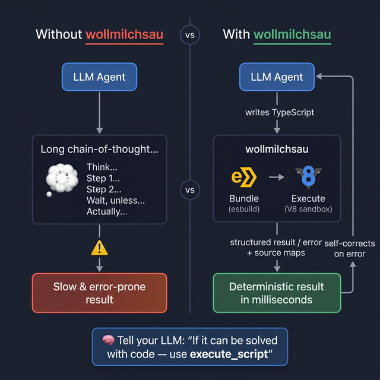

# wollmilchsau — Stop Making the LLM Think. Let It Write Code.

> **The smarter approach:** When a problem can be solved with a small program, don't make the LLM reason through it step by step. Give it a sandbox, let it write a TypeScript solution, and get a deterministic result in milliseconds.

Copyright (c) 2026 Michael Lechner. Licensed under the MIT License.

> 🇩🇪 [Deutsche Version](README.de.md)

---

## The Problem: LLMs Waste Time "Thinking"

LLMs often spend dozens of tokens — and precious reasoning time — working through problems that a simple program could solve in under a millisecond:

- Parsing and transforming data
- Complex calculations or aggregations  
- Regex-based text processing
- Sorting, filtering, and formatting

**wollmilchsau** gives your AI agent a JavaScript/TypeScript execution sandbox. Instead of looping through a long chain-of-thought, the agent can write a small program, run it, and get a precise result.

### How to tell your LLM to use it

Add this to your system prompt:

> *"If a task can be solved more easily or reliably with a small program (e.g. data transformation, calculation, parsing), use the `execute_script` tool. Do not reason through something you can compute."*

---

## How It Works



**The loop:** The agent writes code → wollmilchsau runs it → returns structured result or error with source maps → agent fixes and retries. **Self-correcting by design.**

---

## Features

| Feature | Description |
|---|---|
| 🔐 **Sandboxed V8** | No network, no filesystem, no Node.js APIs |
| ⚡ **In-Process esbuild** | TypeScript bundling in microseconds, no subprocess |
| 🗺️ **Source Maps** | Errors point to the exact TypeScript line |
| 🖼️ **Tool Icons** | Visual representation in MCP-compliant clients |
| 📦 **Artifact Integration** | Automated saving of large outputs via `openArtifact()` |
| 📊 **Structured Output** | JSON Schema based results for reliable tool parsing |
| 🗂️ **ZIP Request Logging** | Full audit trail of every LLM code execution |
| 🔌 **stdio + SSE** | Works locally (Claude Desktop) and remotely |

---

## Getting Started

### Install (Linux)

```bash
# via install script
curl -sfL https://raw.githubusercontent.com/hmsoft0815/wollmilchsau/main/scripts/install.sh | sh

# or download .deb / .rpm from releases
```

> [!NOTE]
> Due to the V8 dependency (CGO), we provide automated binaries for **Linux amd64** only. For macOS/Windows, build from source.

### Build from Source

```bash
# requires build-essential (Linux) or llvm (macOS)
make build
# → build/wollmilchsau
```

### Docker

```bash
docker build -t wollmilchsau .
docker run -p 8000:8000 wollmilchsau
```

### Run

```bash
# stdio mode (default, for Claude Desktop)
./build/wollmilchsau

# SSE/HTTP mode (for remote agents)
./build/wollmilchsau -addr :8080

# with full request logging (ZIP archives)
./build/wollmilchsau -log-dir /var/log/wollmilchsau

# enable artifact service (required for artifact.* and openArtifact())
./build/wollmilchsau -enable-artifacts -artifact-addr localhost:50051

# show version and tool schema
./build/wollmilchsau -version
./build/wollmilchsau -dump
```

#### Command Line Flags

| Flag | Description |
|---|---|
| `-addr` | Listen address for SSE (e.g. `:8080`). If empty, uses stdio. |
| `-log-dir` | Directory to store complete request/response ZIP archives (optional). |
| `-enable-artifacts` | **Required** to enable the artifact service integration (`artifact` global object, `wollmilchsau.openArtifact`, and `execute_artifact` tool). |
| `-artifact-addr` | gRPC address of the `mlcartifact` server (e.g. `localhost:50051`). Optional, uses defaults if empty. |
| `-dump` | Dumps the MCP tool schema to stdout and exits. |
| `-version` | Shows version information and exits. |

---

## Claude Desktop Integration

Add to your configuration file:

- **macOS**: `~/Library/Application Support/Claude/claude_desktop_config.json`
- **Windows**: `%APPDATA%\Claude\claude_desktop_config.json`

```json
{
  "mcpServers": {
    "wollmilchsau": {
      "command": "wollmilchsau",
      "args": ["-log-dir", "/your/log/path"]
    }
  }
}
```

---

## MCP Tools

### `execute_script`
Execute a single TypeScript/JavaScript snippet.
- `code` — The code to run
- `timeoutMs` — Optional, default 10s

### `execute_project`
Execute a multi-file TypeScript project.
- `files` — Array of `{name, content}` objects
- `entryPoint` — Entry file (e.g. `main.ts`)
- `timeoutMs` — Optional

### `check_syntax`
Validate TypeScript syntax without executing. Returns diagnostics with source positions.

---

## Sandbox Constraints

The execution environment is strictly isolated for safety:

- **No network:** `fetch`, `XMLHttpRequest` disabled
- **No timers:** `setTimeout`, `setInterval` disabled
- **No Node.js APIs:** No `fs`, `os`, `process`, DOM
- **Memory limit:** 128MB heap
- **CPU limit:** Configurable timeout (default 10s)
- **Pure logic:** Ideal for computation, transformation, parsing

---

## Artifact Integration

When [`mlcartifact`](https://github.com/hmsoft0815/mlcartifact) is running, large outputs (charts, reports, datasets) can be saved as persistent artifacts.

**wollmilchsau** provides a high-level API for this:

```typescript
const fh = wollmilchsau.openArtifact("report.csv", "text/csv");
fh.write("id,name\n1,Alpha\n2,Beta");
const meta = fh.close(); 
// Returns: { id, uri, name, mimeType, fileSize }
```

When using `openArtifact()`, **wollmilchsau** automatically adds an MCP `resource_link` to the tool response, allowing the LLM client to display or download the artifact immediately.

> [!TIP]
> This is especially powerful for report generation workflows where the agent writes data-processing code and the result is auto-persisted and linked.

---

## Stack

| Component | Library | Purpose |
|---|---|---|
| MCP Protocol | `mark3labs/mcp-go` | JSON-RPC 2.0 |
| TS Bundling | `evanw/esbuild` | Fast in-process transpilation |
| JS Execution | `rogchap/v8go` | CGo bindings to V8 |
| Source Maps | Custom | VLQ decoding & position resolution |

---

## 📜 License & Ethical Use

Licensed under the **MIT License**.

### 🕊️ Author's Note *(non-binding)*
I kindly ask that this software **not** be used for:
- Military purposes or weapons development
- Activities supporting the military aggression against Ukraine

Additionally, I explicitly request that **Isensix, Inc.** and its acquirer **Dwyer-Omega** do not use this software.

*This is an ethical appeal, not a legal modification of the MIT License.*
