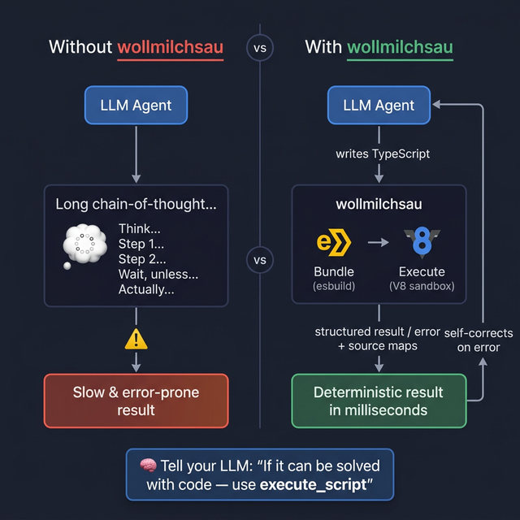

# wollmilchsau — Stop Making the LLM Think. Let It Write Code.

> **The smarter approach:** When a problem can be solved with a small program, don't make the LLM reason through it step by step. Give it a sandbox, let it write a TypeScript solution, and get a deterministic result in milliseconds.

Copyright (c) 2026 Michael Lechner. Licensed under the MIT License.

> 🇩🇪 [Deutsche Version](README.de.md)

---

## The Problem: LLMs Waste Time "Thinking"

LLMs often spend dozens of tokens — and precious reasoning time — working through problems that a simple program could solve in under a millisecond:

- Parsing and transforming data
- Complex calculations or aggregations  
- Regex-based text processing
- Sorting, filtering, and formatting

**wollmilchsau** gives your AI agent a JavaScript/TypeScript execution sandbox. Instead of looping through a long chain-of-thought, the agent can write a small program, run it, and get a precise result.

### How to tell your LLM to use it

Add this to your system prompt:

> *"If a task can be solved more easily or reliably with a small program (e.g. data transformation, calculation, parsing), use the `execute_script` tool. Do not reason through something you can compute."*

---

## 💡 Real-World Examples: Where LLMs Fail & Code Shines

### ⏱️ Example 1: Date & Time Arithmetic (Leap Years & Epochs)
* **The Question:** *"How many minutes have passed since 1970-01-01 00:00 UTC until now?"*
* **LLM without sandbox:** Approximates days with 365.25, gets confused by leap years, and generates hallucinations or conflicting estimates across steps.
* **With `execute_script`:**
  ```typescript
  const start = new Date("1970-01-01T00:00:00Z").getTime();
  const now = Date.now();
  const minutes = Math.floor((now - start) / 60000);
  console.log(`${minutes.toLocaleString("en-US")} minutes passed`);
  ```
  *(Millisecond-exact, 100% deterministic in 2ms).*

### 📈 Example 2: Statistical Metrics & Sensor Data
* **The Question:** *"Here are 5 sensor readings [21.4, 22.8, 21.9, 23.5, 22.1]. Compute the mean and sample standard deviation."*
* **LLM without sandbox:** Struggles with square roots ($\sqrt{\dots}$) and variance sums, leading to subtle rounding and reasoning errors.
* **With `execute_script`:**
  ```typescript
  const data = [21.4, 22.8, 21.9, 23.5, 22.1];
  const n = data.length;
  const avg = data.reduce((a, b) => a + b, 0) / n;
  const variance = data.reduce((a, b) => a + Math.pow(b - avg, 2), 0) / (n - 1);
  const stdDev = Math.sqrt(variance);

  console.log(JSON.stringify({
    mean: Number(avg.toFixed(2)),
    stdDev: Number(stdDev.toFixed(4))
  }, null, 2));
  ```

### 🧪 Example 3: Write Code & Verify Immediately with Test Cases (Live Testing)
* **The Question:** *"Write a function that validates German IBANs (mod-97 check digits) and test it with two sample inputs."*
* **LLM without sandbox:** Mentally simulates the code execution. On tricky logic (like BigInt modulo 97), the LLM misses subtle bugs and confidently claims broken code works.
* **With `execute_script`:**
  ```typescript
  function validateGermanIBAN(iban: string): boolean {
    const clean = iban.replace(/\s+/g, "").toUpperCase();
    if (!/^DE\d{20}$/.test(clean)) return false;
    // DE -> 1314 to the end
    const rearranged = clean.slice(4) + "1314" + clean.slice(2, 4);
    return BigInt(rearranged) % 97n === 1n;
  }

  const tests = [
    "DE02100100100123456789", // valid
    "DE00100100100123456789"  // invalid
  ];

  tests.forEach(iban => {
    console.log(`${iban}: ${validateGermanIBAN(iban) ? "VALID" : "INVALID"}`);
  });
  ```
  *(The LLM runs the code in the sandbox, inspects the real `console.log` output, and returns guaranteed verified, working code to the user).*

> 📖 **More Examples (Log parsing with Lodash, Geo-Spatial Haversine distance, JWT verification):** See [docs/EXAMPLES.md](docs/EXAMPLES.md).

---

## How It Works



**The loop:** The agent writes code → wollmilchsau runs it → returns structured result or error with source maps → agent fixes and retries. **Self-correcting by design.**

---

## Features

| Feature | Description |
|---|---|
| 🔐 **Sandboxed V8** | No network, no filesystem, no Node.js APIs |
| ⚡ **In-Process esbuild** | TypeScript bundling in microseconds, no subprocess |
| 🗺️ **Source Maps** | Errors point to the exact TypeScript line |
| 🖼️ **Tool Icons** | Visual representation in MCP-compliant clients |
| 📦 **Artifact Integration** | Automated saving of large outputs via `openArtifact()` |
| 📊 **Structured Output** | JSON Schema based results for reliable tool parsing |
| 🗂️ **ZIP Request Logging** | Full audit trail of every LLM code execution |
| 🔌 **stdio + SSE** | Works locally (Claude Desktop) and remotely |

---

## Getting Started

### Install (Linux)

```bash
# via install script
curl -sfL https://raw.githubusercontent.com/hmsoft0815/wollmilchsau/main/scripts/install.sh | sh

# or download .deb / .rpm from releases
```

> [!NOTE]
> Due to the V8 dependency (CGO), we provide automated binaries for **Linux amd64** only. For macOS/Windows, build from source.

### Build from Source

```bash
# requires build-essential (Linux) or llvm (macOS)
make build
# → build/wollmilchsau
```

### Docker

```bash
docker build -t wollmilchsau .
docker run -p 8000:8000 wollmilchsau
```

### Run

```bash
# stdio mode (default, for Claude Desktop)
./build/wollmilchsau

# SSE/HTTP mode (for remote agents)
./build/wollmilchsau -addr :8080

# with full request logging (ZIP archives)
./build/wollmilchsau -log-dir /var/log/wollmilchsau

# enable artifact service (required for artifact.* and openArtifact())
./build/wollmilchsau -enable-artifacts -artifact-addr localhost:50051

# show version and tool schema
./build/wollmilchsau -version
./build/wollmilchsau -dump
```

#### Command Line Flags

| Flag | Description |
|---|---|
| `-addr` | Listen address for SSE (e.g. `:8080`). If empty, uses stdio. |
| `-log-dir` | Directory to store complete request/response ZIP archives (optional). |
| `-enable-artifacts` | **Required** to enable the artifact service integration (`artifact` global object, `wollmilchsau.openArtifact`, and `execute_artifact` tool). |
| `-artifact-addr` | gRPC address of the `mlcartifact` server (e.g. `localhost:50051`). Optional, uses defaults if empty. |
| `-dump` | Dumps the MCP tool schema to stdout and exits. |
| `-version` | Shows version information and exits. |
| `-bundled-js-deps` | Comma-separated npm packages to bundle into the V8 sandbox (e.g. `crypto-js,lodash,mathjs,zod`). Default: all standard packages. **Packages are installed only at server startup — no runtime installation possible.** |


---

## Claude Desktop Integration

Add to your configuration file:

- **macOS**: `~/Library/Application Support/Claude/claude_desktop_config.json`
- **Windows**: `%APPDATA%\Claude\claude_desktop_config.json`

```json
{
  "mcpServers": {
    "wollmilchsau": {
      "command": "wollmilchsau",
      "args": ["-log-dir", "/your/log/path"]
    }
  }
}
```

---

## MCP Tools

### `execute_script`
Execute a single TypeScript/JavaScript snippet.
- `code` — The code to run
- `timeoutMs` — Optional, default 10s

### `execute_project`
Execute a multi-file TypeScript project.
- `files` — Array of `{name, content}` objects
- `entryPoint` — Entry file (e.g. `main.ts`)
- `timeoutMs` — Optional

### `list_js_packages`

Returns all bundled JS packages with name, version, type, and description. **Packages are installed only at server startup — no runtime installation possible.**

### `check_syntax`

Validate TypeScript syntax without executing. Returns diagnostics with source positions.

---

## Sandbox Constraints

The execution environment is strictly isolated for safety:

- **No network:** `fetch`, `XMLHttpRequest` disabled
- **No timers:** `setTimeout`, `setInterval` disabled
- **No Node.js APIs:** No `fs`, `os`, `process`, DOM
- **No internet access in sandbox** (no `npm install`, no package downloads at runtime)
- **Memory limit:** 128MB heap
- **CPU limit:** Configurable timeout (default 10s)
- **Pure logic:** Ideal for computation, transformation, parsing

---

## Bundled JS Packages

wollmilchsau can inject Node.js packages into the V8 sandbox, available to agents via `require()` or ES-module imports. Packages are installed at server startup only — **no runtime installation possible** (sandboxing).

### Default Packages

| Package | Description |
|---|---|
| `crypto-js` | Cryptographic functions (SHA-256, AES, MD5, HMAC) |
| `lodash` | Utility library for arrays, numbers, objects, strings |
| `@types/lodash` | TypeScript type definitions for lodash |
| `mathjs` | Mathematics engine with matrices, fractions, units |
| `zod` | TypeScript-first schema validation with type inference |

### Usage Example

```bash
# Install additional packages at startup
./build/wollmilchsau -bundled-js-deps=crypto-js,lodash,mathjs,zod

# Or list available packages (agent-facing)
# Use the `list_js_packages` MCP tool to query all bundled packages
```

### Agent Instructions

Agents can call the **`list_js_packages`** MCP tool in sandbox context to discover all available packages (name, version, type, description). Always check before writing code that depends on a package.

### Important Constraints

- **Install at startup only:** No `npm install` or internet access during sandbox execution.
- **CJS vs ESM:** Packages are served as CommonJS. ES-module imports (`import x from 'y'`) may cause issues — prefer `require('y')`.
- **Scoped packages** (e.g., `@types/*`) are correctly installed and resolved by esbuild.

---

## Artifact Integration

When [`mlcartifact`](https://github.com/hmsoft0815/mlcartifact) is running, large outputs (charts, reports, datasets) can be saved as persistent artifacts.

**wollmilchsau** provides a high-level API for this:

```typescript
const fh = wollmilchsau.openArtifact("report.csv", "text/csv");
fh.write("id,name\n1,Alpha\n2,Beta");
const meta = fh.close(); 
// Returns: { id, uri, name, mimeType, fileSize }
```

When using `openArtifact()`, **wollmilchsau** automatically adds an MCP `resource_link` to the tool response, allowing the LLM client to display or download the artifact immediately.

> [!TIP]
> This is especially powerful for report generation workflows where the agent writes data-processing code and the result is auto-persisted and linked.

---

## Stack

| Component | Library | Purpose |
|---|---|---|
| MCP Protocol | `modelcontextprotocol/go-sdk` | Official Go MCP SDK |
| TS Bundling | `evanw/esbuild` | Fast in-process transpilation |
| JS Execution | `rogchap/v8go` | CGo bindings to V8 |
| Source Maps | Custom | VLQ decoding & position resolution |

---

## 📜 License & Ethical Use

Licensed under the **MIT License**.

### 🕊️ Author's Note *(non-binding)*
I kindly ask that this software **not** be used for:
- Military purposes or weapons development
- Activities supporting the military aggression against Ukraine

Additionally, I explicitly request that **Isensix, Inc.** and its acquirer **Dwyer-Omega** do not use this software.

*This is an ethical appeal, not a legal modification of the MIT License.*
